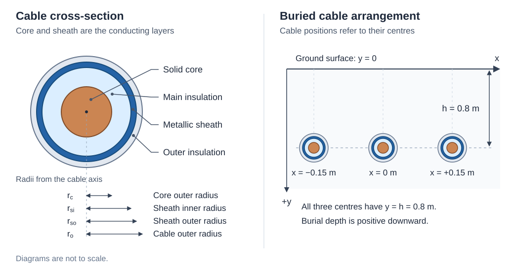

<!-- Auto-generated by doc/generate_device_docs.py. Do not edit this file directly. -->

## Line

VeraGrid uses the same `Line` branch for overhead and underground AC lines. Both connect two buses and use a
series impedance and a shunt admittance; their physical construction determines how these parameters are calculated.
The reusable catalogue objects are distinct from the branch installed in the network:

| Purpose | Overhead lines | Underground lines |
|---|---|---|
| Conductor or cable construction | `Wire` | `UndergroundCableType` |
| Geometry and per-unit-length electrical parameters | `OverheadLineType` (Tower) | `UndergroundLineType` |
| Connection between buses, length and applied template | `Line` | `Line` |

The [underground cable construction](../modelling.md#undergroundcabletype) and
[underground line template](../modelling.md#undergroundlinetype) catalogue entries describe all their input parameters.
The following sections explain the common electrical model and the calculation specific to each technology.

### Common electrical model

#### π model

Transmission lines are mathematically modelled to describe their electrical behaviour. The inductive and resistive
effects of multiconductor lines are represented by a series impedance matrix, while capacitive effects are modelled as
a shunt admittance matrix. Together, these form the basis of the $\pi$-equivalent model commonly used in power system
studies.

<div style="text-align: center;">
    
</div>

It consists of:

- Series impedance: $Z_{\text{series}} = R + jX$

- Shunt admittance: $Y_{\text{shunt}} = G + jB$

In the $\pi$-model, $R$ represents conductor resistance, $X$ the self and mutual inductive reactances, $G$ the shunt
conductance through insulation, and $B$ the shunt susceptance from line capacitance. Half of the total shunt admittance
is placed at each end, with series impedance in the middle.

#### Phase matrices, length and per-unit conversion

Matrix dimensions depend on the conductors represented, not on a universal five-wire assumption. A primitive matrix
retains individual conductors, including any ground wires or metallic sheaths. After the appropriate grounding
conditions and reductions, a complete three-phase circuit has a $3\times3$ phase matrix:

$$
\vec{Z} =
\begin{bmatrix}
\vec{Z}_{aa} & \vec{Z}_{ab} & \vec{Z}_{ac} \\
\vec{Z}_{ba} & \vec{Z}_{bb} & \vec{Z}_{bc} \\
\vec{Z}_{ca} & \vec{Z}_{cb} & \vec{Z}_{cc}
\end{bmatrix}
$$

Single- and two-phase circuits retain only their represented phases. A metallic sheath is not a fourth phase or an
explicit network neutral. Phase matrices preserve geometrical asymmetry and mutual coupling, which cannot generally
be replaced by a single positive-sequence impedance.

Use primes for quantities per unit length: $Z'$ in $\Omega$/km and $Y'$ in S/km. For a branch of length $\ell$ in km,
with voltage base $V_b$ in kV and three-phase power base $S_b$ in MVA:

$$
Z_b=\frac{V_b^2}{S_b},\qquad Z_{\mathrm{pu}}=\frac{\ell Z'}{Z_b},\qquad
Y_{\mathrm{sh,pu}}=\ell Y' Z_b,\qquad Y_{\mathrm{s,pu}}=Z_{\mathrm{pu}}^{-1}.
$$

The two diagonal blocks of the branch nodal admittance are $Y_{\mathrm{s,pu}}+Y_{\mathrm{sh,pu}}/2$;
the off-diagonal blocks are $-Y_{\mathrm{s,pu}}$. The connected-bus voltage supplies the base when applying a template.
The cable builder displays admittance in $\mu$S/km, whereas the template's numerical admittance matrices use S/km.
The branch stores `ys` in p.u. and `ysh` in micro-p.u.; the compiler converts the latter before splitting it between ends.

### Overhead lines

Overhead lines consist of conductors above ground, possibly with bundled phase conductors, an explicit neutral or
ground wires. Conductor heights and spacings, internal impedance and the earth-return path determine the parameters.

<div style="text-align: center;">
    
</div>

#### Series impedance

Carson’s equations calculate the series self and mutual impedances of overhead transmission lines, accounting for the
ground return path. They assume long, horizontally arranged conductors with average height for sag effects, homogeneous
and lossless free space, uniform earth properties, and conductor spacing much greater than conductor radius to neglect
proximity effects. The impedance matrix elements are derived from the tower geometry and conductor characteristics.

<div style="text-align: center;">
    
</div>

Then, the following equations are implemented to obtain the self and mutual values:

$$
    \vec{Z}_{ii} = (R_i+R^c_{ii}) + j \left(\omega \frac{\mu_0}{2\pi} \ln{\frac{2h_i}{r_i}} + X_i + X^c_{ii} \right)
    \label{eq:Carson_Zii}
$$

$$
    \vec{Z}_{ij} = \vec{Z}_{ji} =
    R^c_{ij} + j \left( \omega \frac{\mu_0}{2\pi} \ln{\frac{D_{ij}}{d_{ij}}} + X^c_{ij} \right)
    \label{eq:Carson_Zij}
$$

Where:
- $R_i$ and $X_i$ are the internal resistance and reactance of conductor $i$ in $\Omega$/km.
- $R^c$ and $X^c$ are the Carson's correction terms for earth return effects in $\Omega$/km.
- $\mu_0 = 4\pi\cdot 10^{-4}$ is the permeability of free space in H/km.
- $\omega = 2\pi f$ is the angular frequency in rad/s.
- $h_i$ is the average height above ground of conductor $i$ in m.
- $r_i$ is the radius of conductor $i$ in m.
- $d_{ij}$ is the distance between conductors $i$ and $j$ in m.
- $D_{ij}$ is the distance between conductor $i$ and the image of conductor $j$ in m.

The correction terms $R^c$ and $X^c$ are derived from an infinite integral representing the impedance contribution due
to the earth return path.

#### Shunt admittance

Just as series impedance accounts for resistance and inductance, shunt admittance includes capacitance between
conductors and ground, and between conductors themselves. Under the assumptions of lossless air, uniformly grounded
earth, and conductor radii much smaller than inter-conductor spacing, these capacitances can be modelled mathematically
to compute the corresponding shunt admittances.

$$
    P_{ii} = \frac{1}{2 \pi \varepsilon_0} \ln{\frac{2 h_i}{r_i}}
$$

$$
    P_{ij} = \frac{1}{2 \pi \varepsilon_0} \ln{\frac{D_{ij}}{d_{ij}}}
$$

These expressions form Maxwell's potential-coefficient matrix $P$, not the admittance matrix itself. With
$\varepsilon_0=8.854187817\cdot10^{-9}$ F/km, $P$ is in km/F. After conductor bundling and any grounded-conductor
elimination in the potential formulation, the shunt admittance is:

$$
    C'=P^{-1},\qquad Y'=j\omega P^{-1}\quad[\mathrm{S/km}].
$$

The inversion is a matrix inversion, not an element-by-element reciprocal.

#### Ground-wire reduction

Kron's reduction, or node elimination, is a technique from network theory used to simplify a multi-node electrical
network by eliminating certain nodes, often called internal or passive nodes, while preserving the electrical
behaviour at the remaining nodes.

Assuming a set of nodes divided into two groups between ground conductors $g$ (to eliminate) and phase conductors $p$
(to keep), the impedance matrix is partitioned accordingly:

$$
    \vec{Z} =
    \begin{bmatrix}
        \vec{Z}_{gg} & \vec{Z}_{gp} \\
        \vec{Z}_{pg} & \vec{Z}_{pp} 
    \end{bmatrix}
$$

Where:
- $\vec{Z}_{gg}$ is the impedance between eliminated nodes.
- $\vec{Z}_{gp}$ is the mutual impedance between eliminated and preserved nodes.
- $\vec{Z}_{pg}$ is the mutual impedance between preserved and eliminated nodes.
- $\vec{Z}_{pp}$ is the impedance between preserved nodes.

Then, the network equations are:

$$
    \begin{bmatrix}
        \vec{U}_{g} \\
        \vec{U}_{p}
    \end{bmatrix}
    =
    \begin{bmatrix}
        \vec{Z}_{gg} & \vec{Z}_{gp} \\
        \vec{Z}_{pg} & \vec{Z}_{pp} 
    \end{bmatrix}
    \begin{bmatrix}
        \vec{I}_{g} \\
        \vec{I}_{p}
    \end{bmatrix}
$$

Assuming that the eliminated nodes are held at zero voltage because they are grounded, $\vec{U}_{g} = 0$. From the
first row of the system:

$$
    \vec{I}_e = -\vec{Z}_{gg}^{-1} \cdot \vec{Z}_{gp} \cdot \vec{I}_{p}
$$

Then, substituting $\vec{I}_e$ in the second row:

$$
    \vec{U}_p = (\vec{Z}_{pp} - \vec{Z}_{pg} \cdot \vec{Z}_{gg}^{-1} \cdot \vec{Z}_{gp}) \vec{I}_{p}
$$

Finally, the Kron-reduced impedance matrix is defined as:

$$
    \vec{Z}_\text{Kron} = \vec{Z}_{pp} - \vec{Z}_{pg} \cdot \vec{Z}_{gg}^{-1} \cdot \vec{Z}_{gp}
$$

This new matrix allows to describe the electrical behaviour of the remaining phase nodes $p$, while implicitly
incorporating the effect of the eliminated ground nodes $g$, which were assumed to be held at 0 V.

#### Line definition example

```python
import VeraGridEngine.api as gce
import numpy as np

logger = gce.Logger()
grid = gce.MultiCircuit()
grid.fBase = 60

# ----------------------------------------------------------------------------------------------------------------------
# Buses
# ----------------------------------------------------------------------------------------------------------------------
bus_632 = gce.Bus(name='632', Vnom=4.16, xpos=0, ypos=0)
bus_632.is_slack = True
grid.add_bus(obj=bus_632)

bus_671 = gce.Bus(name='671', Vnom=4.16, xpos=0, ypos=100 * 5)
grid.add_bus(obj=bus_671)

# ----------------------------------------------------------------------------------------------------------------------
# Impedance [Ohm/km] and Admittance [S/km]
# ----------------------------------------------------------------------------------------------------------------------
z_601 = np.array([
    [0.3465 + 1j * 1.0179, 0.1560 + 1j * 0.5017, 0.1580 + 1j * 0.4236],
    [0.1560 + 1j * 0.5017, 0.3375 + 1j * 1.0478, 0.1535 + 1j * 0.3849],
    [0.1580 + 1j * 0.4236, 0.1535 + 1j * 0.3849, 0.3414 + 1j * 1.0348]
], dtype=complex) / 1.60934

y_601 = np.array([
    [1j * 6.2998, 1j * -1.9958, 1j * -1.2595],
    [1j * -1.9958, 1j * 5.9597, 1j * -0.7417],
    [1j * -1.2595, 1j * -0.7417, 1j * 5.6386]
], dtype=complex) / 10 ** 6 / 1.60934

# ----------------------------------------------------------------------------------------------------------------------
# Line Configuration
# ----------------------------------------------------------------------------------------------------------------------
config_601 = gce.create_known_abc_overhead_template(name='Config. 601',
                                                    z_nabc=z_601,
                                                    ysh_nabc=y_601,
                                                    phases=np.array([1, 2, 3]),
                                                    Vnom=4.16,
                                                    frequency=60)
grid.add_overhead_line(config_601)

# ----------------------------------------------------------------------------------------------------------------------
# Lines Definition
# ----------------------------------------------------------------------------------------------------------------------
line_632_671 = gce.Line(bus_from=bus_632,
                        bus_to=bus_671,
                        length=2000 * 0.0003048)
line_632_671.apply_template(config_601, grid.Sbase, grid.fBase, logger)
grid.add_line(obj=line_632_671)
```

#### Definition of a line from the wire configuration

**Definition of the exercise**

In this tutorial we are going to define a 3-phase line with 4 wires of two different types.

The cable types are the following:

| name         | r        | x   | gmr      | max_current |
|--------------|----------|-----|----------|-------------|
| ACSR 6/1     | 1.050117 | 0.0 | 0.001274 | 180.0       |
| Class A / AA | 0.379658 | 0.0 | 0.004267 | 263.0       |

These are taken from the data_sheets__ section

The layout is the following:

| Wire         | x(m) | y(m) | Phase |
|--------------|------|------|-------|
| ACSR 6/1     | 0    | 7    | 1 (A) |
| ACSR 6/1     | 0.4  | 7    | 2 (B) |
| ACSR 6/1     | 0.8  | 7    | 3 (C) |
| Class A / AA | 0.3  | 6.5  | 0 (N) |

**Practice**


We may start with a prepared example from the ones provided in the `grids and profiles` folder.
The example file is `Some distribution grid.xlsx`. First define the wires that you are going 
to use in the tower. For that, we proceed to the tab `Database -> Catalogue -> Wire`.


Then, we proceed to the tab `Database -> Catalogue -> Tower`. Then we select
one of the existing towers or we create one with the (+) button.


By clicking on the edit button (pencil) we open a new window with the `Tower builder` editor. 
Here we enter the tower definition, and once we are done, we click on the compute button (calculator). 
Then the tower cross-section will
be displayed and the results will appear in the following tabs.


This tab shows the series impedance matrix ($\Omega / km$) in several forms:

- Per phase without reduction.
- Per phase with the neutral embedded.
- Sequence reduction.


This tab shows the series shunt admittance matrix ($\mu S / km$) in several forms:

- Per phase without reduction.
- Per phase with the neutral embedded.
- Sequence reduction.


When closed, the values are applied to the overhead line catalogue type that we were editing.

### Underground lines

An underground system is built from positioned instances of `UndergroundCableType`. Each instance represents a
single-core cable with a solid conducting core and one concentric tubular metallic sheath. Main insulation separates
the two conductors; outer insulation separates the sheath from the surrounding earth. Thus there are two conducting
layers and two dielectric regions. The model below assumes direct burial in homogeneous, nonmagnetic soil and
ideal grounding of the sheaths when forming the phase-only equivalent.

#### Cable construction and system geometry



Let $r_c$ denote the core radius, $r_{si}$ and $r_{so}$ the inner and outer sheath radii, and $r_o$ the overall
cable radius. From the construction inputs, expressed in mm:

$$
r_c=\frac{d_c}{2},\qquad r_{si}=r_c+t_i,\qquad r_{so}=r_{si}+t_s,\qquad
r_o=\frac{d_{\mathrm{cable}}}{2},\qquad t_o=r_o-r_{so}.
$$

Here $d_c$ is `core_diameter`, $t_i$ is `main_insulation_thickness`, $t_s$ is `sheath_thickness` and
$d_{\mathrm{cable}}$ is `cable_diameter`. The outer insulation thickness $t_o$ is derived, not an independent input.
The electromagnetic equations below use radii in metres, so these dimensions are multiplied by $10^{-3}$ first.
Physically valid concentric layers require $0<r_c<r_{si}<r_{so}<r_o$.

Each cable centre has horizontal coordinate $x_i$ and **positive burial depth** $h_i$, both in metres.
For two distinct cables:

$$
d_{ij}=\sqrt{(x_i-x_j)^2+(h_i-h_j)^2},\qquad
D_{ij}=\sqrt{(x_i-x_j)^2+(h_i+h_j)^2},\qquad
\theta_{ij}=\arccos\frac{h_i+h_j}{D_{ij}}.
$$

$D_{ij}$ is the distance to the other cable's image across the earth surface. For a self term, the earth-return
calculation uses $d_{ii}=r_{o,i}$, $D_{ii}=2h_i$ and $\theta_{ii}=0$.

#### Series impedance

**Material properties and core.** The effective resistivity of each conducting layer is

$$
\rho=\frac{10^{-8}\rho_{\mu\Omega\mathrm{cm}}}{C_f/100}\quad[\Omega\,\mathrm{m}],\qquad
\mu=\mu_0\mu_r,\qquad \mu_0=4\pi\,10^{-7}\ \mathrm{H/m},\qquad \omega=2\pi f.
$$

$C_f$ is the conducting filling factor in percent, **not capacitance**. It accounts for the conducting fraction
of the geometric cross-section. Resistance is calculated from material resistivity and geometry; the informational
`core_dc_resistance` does not replace it.

Using modified Bessel functions $I_\nu$ and $K_\nu$, the solid-core surface impedance is

$$
m_c=\sqrt{\frac{j\omega\mu_c}{\rho_c}}\sqrt{k_s},\qquad
z_c=1000\frac{\rho_c m_c}{2\pi r_c}\frac{I_0(m_c r_c)}{I_1(m_c r_c)}\quad[\Omega/\mathrm{km}].
$$

The factor $k_s$ is `skin_effect_factor`; the factor 1000 converts impedance per metre to impedance per kilometre.
No proximity-effect correction is applied by this calculation.

**Metallic sheath.** For the sheath propagation constant $m_s=\sqrt{j\omega\mu_s/\rho_s}$, define
$u=m_s r_{si}$, $v=m_s r_{so}$ and $\Delta=I_1(v)K_1(u)-I_1(u)K_1(v)$. Its inner, outer and mutual
surface impedances, respectively, are

$$
z_{si}=1000\frac{\rho_s m_s}{2\pi r_{si}}
\frac{I_0(u)K_1(v)+K_0(u)I_1(v)}{\Delta},
$$

$$
z_{so}=1000\frac{\rho_s m_s}{2\pi r_{so}}
\frac{I_0(v)K_1(u)+K_0(v)I_1(u)}{\Delta},\qquad
z_{sm}=1000\frac{\rho_s}{2\pi r_{si}r_{so}\Delta}.
$$

**Insulating regions and internal matrix.** The longitudinal magnetic-field contribution of an insulating annulus is

$$
z_{\mathrm{ins}}(r_1,r_2)=1000\frac{j\omega\mu_0}{2\pi}\ln\frac{r_2}{r_1}.
$$

This is an inductive contribution to the series model, not a current flowing through the dielectric.
Set $L_{11}=z_c+z_{\mathrm{ins}}(r_c,r_{si})+z_{si}$,
$L_{22}=z_{so}+z_{\mathrm{ins}}(r_{so},r_o)$ and $L_{12}=-z_{sm}$.
Transforming the two coaxial loop equations to core/sheath conductor quantities gives

$$
Z'_{\mathrm{int}}=
\begin{bmatrix}
L_{11}+2L_{12}+L_{22}&L_{12}+L_{22}\\
L_{12}+L_{22}&L_{22}
\end{bmatrix}.
$$

**Earth return.** With soil resistivity $\rho_e$ in $\Omega$ m, conductivity $\sigma_e=1/\rho_e$ in S/m and
$m_e=\sqrt{j\omega\mu_0\sigma_e}$, the earth-return contribution is

$$
z'_{e,ij}=1000\left[
\frac{j\omega\mu_0}{2\pi}\left(K_0(m_e d_{ij})-K_0(m_e D_{ij})\right)
+\frac{\omega\mu_0}{\pi}\left(P(\alpha_{ij},\theta_{ij})+jQ(\alpha_{ij},\theta_{ij})\right)
\right],\qquad \alpha_{ij}=D_{ij}\sqrt{\omega\mu_0\sigma_e}.
$$

$P$ and $Q$ are the Carson correction coefficients. The implementation evaluates their small-argument expansion
through eighth order in `calculate_carson_coefficients()`; its stated range is $\alpha<5$. It does not implement a
separate large-argument branch. See the numerical scope note below for the additional fixed self-term adjustment.

**Primitive assembly.** For $n$ cables, order the conductors as
$[c_1,\ldots,c_n,s_1,\ldots,s_n]$: all cores first, then all sheaths. With the earth-return matrix $E$ and each
cable's internal matrix entries, the $2n\times2n$ series matrix is

$$
Z'_{\mathrm{primitive}}=
\begin{bmatrix}
E+\operatorname{diag}(Z'_{\mathrm{int},11})&E+\operatorname{diag}(Z'_{\mathrm{int},12})\\
E+\operatorname{diag}(Z'_{\mathrm{int},12})&E+\operatorname{diag}(Z'_{\mathrm{int},22})
\end{bmatrix}.
$$

Thus three single-core cables produce a $6\times6$ primitive matrix, not a six-phase circuit.

#### Shunt admittance

The main and outer coaxial capacitances per metre are

$$
C'_m=\frac{2\pi\varepsilon_0\varepsilon_{r,m}}{\ln(r_{si}/r_c)},\qquad
C'_o=\frac{2\pi\varepsilon_0\varepsilon_{r,o}}{\ln(r_o/r_{so})},\qquad
\varepsilon_0=8.854187817\cdot10^{-12}\ \mathrm{F/m}.
$$

For each insulating region, relative permittivity controls capacitance and loss tangent controls dielectric losses:

$$
y'=1000\,\omega C'(\tan\delta+j)\quad[\mathrm{S/km}].
$$

Here $\tan\delta$ is dimensionless, not a percentage. With diagonal matrices $Y_m$ and $Y_o$ containing these
main and outer admittances, the primitive matrix in the same core-then-sheath order is

$$
Y'_{\mathrm{primitive}}=
\begin{bmatrix}Y_m&-Y_m\\-Y_m&Y_m+Y_o\end{bmatrix}.
$$

This screened coaxial model has no direct electrostatic coupling between the cores of different cables.
Both insulating regions are nevertheless present in the primitive matrix.

#### Grounded-sheath reduction

The phase-only model eliminates the sheaths under an ideal-grounding assumption. Partition the primitive series
matrix into core and sheath blocks, indexed $c$ and $s$. Setting the longitudinal sheath voltage drop to zero gives

$$
Z'_{\mathrm{phase}}=Z'_{cc}-Z'_{cs}(Z'_{ss})^{-1}Z'_{sc}.
$$

For the shunt equations $I_c=Y'_{cc}U_c+Y'_{cs}U_s$, ideal grounding means $U_s=0$. Therefore

$$
Y'_{\mathrm{phase}}=Y'_{cc}=Y_m.
$$

The shunt reduction is **not** the Schur complement used for series impedance. In particular, outer-insulation
permittivity and loss tangent affect the primitive shunt matrix but not the reduced core shunt matrix under this
grounding assumption. Finite sheath-earthing impedance, single-point bonding and cross-bonding are not represented.

#### Phase and sequence matrices

The reduced matrices keep the phase ordering defined by the cable composition. For each complete ABC circuit,
symmetrical components are obtained without transposing or averaging the physical geometry:

$$
A=\begin{bmatrix}1&1&1\\1&a^2&a\\1&a&a^2\end{bmatrix},\qquad a=e^{j2\pi/3},\qquad
Z'_{012}=A^{-1}Z'_{abc}A,\qquad Y'_{012}=A^{-1}Y'_{abc}A.
$$

The sequence order is zero, positive, negative. Multiple complete circuits use a block-diagonal transformation.
Sequence matrices need not be diagonal for an asymmetric system. A single- or two-phase system retains its valid
phase matrices but has no complete sequence representation. The scalar `R`, `X`, `B`, `R0`, `X0`, `B0` fields
summarize diagonal sequence entries when available; they do not replace the full phase matrices in unbalanced studies.

#### Definition from the GUI

The following example uses three identical 10 kV cables with the construction defaults listed in
[UndergroundCableType](../modelling.md#undergroundcabletype).

1. In `Model / Database -> Catalogue -> Underground cable type`, add an entry named `Demo cable`.
   Set `nominal voltage` to 10 kV. Keep the default 10 mm core diameter, 5 mm main insulation thickness,
   1 mm sheath thickness and 30 mm overall cable diameter, with the remaining material defaults.
2. In `Catalogue -> Underground line`, create `Buried circuit` and open its editor using the edit button.
   Set voltage to 10 kV, frequency to 50 Hz, earth resistivity to 100 $\Omega$ m and rated current to 0.4 kA.
3. Select `Demo cable` in the cable catalogue and press `+` three times. Set the composition rows to:

   | Cable | X (m) | Depth (m) | Phase | Derived circuit | Derived phase name |
   |---|---:|---:|---:|---:|---|
   | Demo cable | -0.15 | 0.8 | 1 | 1 | A |
   | Demo cable | 0.00 | 0.8 | 2 | 1 | B |
   | Demo cable | 0.15 | 0.8 | 3 | 1 | C |

4. Press the calculator button. Check the geometry and choose primitive, phase or sequence impedance/admittance
   in the matrix selector. Impedance is displayed in $\Omega$/km and admittance in $\mu$S/km.
5. Accept the cable-system editor. Double-click the network line in the schematic and open its `Line editor` tab.
   Choose `Buried circuit` under `Available templates`, then press `Load template values`. Set length to 1 km
   and press the tab's `Accept` button to apply the template. Selecting a combo-box entry alone does not load it.

The line editor lists templates matching the connected-bus nominal voltage, so use 10 kV buses for this example.
The current GUI applies circuit 1 for an underground template; it does not offer arbitrary underground circuit selection.

The construction is shared catalogue data: editing it can affect several templates. Recalculate affected systems
and reapply their templates to the branches after changing construction, geometry or frequency. Reapply the template
after changing the branch length as well. An existing branch's applied matrices must not be assumed to refresh merely
because its template reference or a construction field changed.

#### Definition from Python

This example builds the same geometry without opening the GUI. The frequency of the system and the network agree;
`Imax` is supplied as a rating, not computed from a thermal model.

```python
import VeraGridEngine.api as vg


def underground_line_example() -> None:
    """Create a cable construction, calculate its system and apply it to a branch.

    :return: None.
    """
    grid: vg.MultiCircuit = vg.MultiCircuit()
    grid.fBase = 50.0
    logger: vg.Logger = vg.Logger()

    # The reusable construction describes layers, not their installation positions.
    cable: vg.UndergroundCableType = vg.UndergroundCableType(
        name="Demo cable", nominal_voltage=10.0,
        core_diameter=10.0, main_insulation_thickness=5.0,
        sheath_thickness=1.0, cable_diameter=30.0,
    )
    grid.add_underground_cable(cable)
    system: vg.UndergroundLineType = vg.UndergroundLineType(
        name="Buried circuit", Vnom=10.0, Imax=0.4,
        freq=50.0, earth_resistivity=100.0,
    )

    # One positioned instance per phase; depth is positive below the earth surface.
    phase: int
    xpos: float
    for phase, xpos in enumerate((-0.15, 0.0, 0.15), start=1):
        system.add_cable_relationship(cable=cable, xpos=xpos, ypos=0.8, phase=phase)
    calculated: bool = system.compute(logger=logger)
    if calculated:
        grid.add_underground_line(system)
        print("Z phase [ohm/km]:", system.z_nabc)
        print("Y phase [S/km]:", system.y_nabc)

        # Applying the template includes the branch length and the network base.
        source: vg.Bus = grid.add_bus(vg.Bus(name="Source", Vnom=10.0))
        destination: vg.Bus = grid.add_bus(vg.Bus(name="Destination", Vnom=10.0))
        line: vg.Line = grid.add_line(
            vg.Line(bus_from=source, bus_to=destination, length=1.0)
        )
        line.apply_template(obj=system, Sbase=grid.Sbase, freq=grid.fBase, logger=logger)
    else:
        print(logger)


underground_line_example()
```

For this example, the primitive matrices are $6\times6$ and the phase matrices are $3\times3$.
The reduced self-impedance of phase A is approximately $0.36590254+j0.15735713$ $\Omega$/km;
its shunt susceptance is approximately 57.99 $\mu$S/km. These are per-kilometre quantities, not per-unit branch values.

### Registered properties
Profile-enabled properties: `active`, `rate`, `contingency_factor`, `protection_rating_factor`, `Cost`, `temp_oper`.

|             name              |    class_type     |unit |mandatory|max_chars|                                                                                                              descriptions                                                                                                               |has_profile|comment|
|-------------------------------|-------------------|-----|---------|---------|-----------------------------------------------------------------------------------------------------------------------------------------------------------------------------------------------------------------------------------------|-----------|-------|
|idtag                          |str                |     |False    |         |Unique ID                                                                                                                                                                                                                                |False      |       |
|name                           |str                |     |False    |         |Name of the device.                                                                                                                                                                                                                      |False      |       |
|code                           |str                |     |False    |         |Secondary ID                                                                                                                                                                                                                             |False      |       |
|rdfid                          |str                |     |False    |         |RDF ID for further compatibility                                                                                                                                                                                                         |False      |       |
|action                         |enum ActionType    |     |False    |         |Object action to perform. Only used for model merging.                                                                                                                                                                                   |False      |       |
|selected_to_merge              |bool               |     |False    |         |Whether this object should be applied during diff merge.                                                                                                                                                                                 |False      |       |
|comment                        |str                |     |False    |         |User comment                                                                                                                                                                                                                             |False      |       |
|diff_changes                   |MergeInformation   |     |False    |         |                                                                                                                                                                                                                                         |False      |       |
|modelling_authority            |Modelling Authority|     |False    |         |Modelling authority of this asset                                                                                                                                                                                                        |False      |       |
|commissioned_date              |int                |     |False    |         |Commissioned date of the asset                                                                                                                                                                                                           |False      |       |
|decommissioned_date            |int                |     |False    |         |Decommissioned date of the asset                                                                                                                                                                                                         |False      |       |
|build_status                   |enum BuildStatus   |     |False    |         |Device build status. Used in expansion planning.                                                                                                                                                                                         |False      |       |
|owners                         |AssociationsList   |p.u. |False    |         |Owners associations to injections                                                                                                                                                                                                        |False      |       |
|rms_model                      |DaeBlock           |     |False    |         |RMS dynamic model                                                                                                                                                                                                                        |False      |       |
|emt_model                      |DaeBlock           |     |False    |         |EMT dynamic model                                                                                                                                                                                                                        |False      |       |
|rms_template                   |RMS template       |     |False    |         |Native RMS template used. Assigning it clears rms_fmu_template.                                                                                                                                                                          |False      |       |
|emt_template                   |EMT template       |     |False    |         |Native EMT template used. Assigning it clears emt_fmu_template.                                                                                                                                                                          |False      |       |
|rms_fmu_template               |FMU template       |     |False    |         |RMS FMU template used only by RMS simulations. Assigning it clears rms_template.                                                                                                                                                         |False      |       |
|emt_fmu_template               |FMU template       |     |False    |         |EMT FMU template used only by EMT simulations. Assigning it clears emt_template.                                                                                                                                                         |False      |       |
|rms_fmu_import_config          |str                |     |False    |         |Serialized FMU Co-Simulation RMS configuration                                                                                                                                                                                           |False      |       |
|emt_fmu_import_config          |str                |     |False    |         |Serialized FMU Co-Simulation EMT configuration                                                                                                                                                                                           |False      |       |
|rms_fmu_me_import_config       |str                |     |False    |         |Serialized FMU Model Exchange RMS configuration                                                                                                                                                                                          |False      |       |
|emt_fmu_me_import_config       |str                |     |False    |         |Serialized FMU Model Exchange EMT configuration                                                                                                                                                                                          |False      |       |
|bus_from                       |Bus                |     |False    |         |Name of the bus at the "from" side                                                                                                                                                                                                       |False      |       |
|bus_to                         |Bus                |     |False    |         |Name of the bus at the "to" side                                                                                                                                                                                                         |False      |       |
|active                         |bool               |     |False    |         |Is active?                                                                                                                                                                                                                               |True       |       |
|reducible                      |bool               |     |False    |         |Is the branch to be reduced by the topology preprocessor?                                                                                                                                                                                |False      |       |
|design_rate                    |float              |MVA  |False    |         |Design thermal rating power that is not modified for operational reasons or otherwise                                                                                                                                                    |False      |       |
|rate                           |float              |MVA  |False    |         |Operational thermal rating power                                                                                                                                                                                                         |True       |       |
|contingency_factor             |float              |p.u. |False    |         |Rating multiplier for contingencies                                                                                                                                                                                                      |True       |       |
|protection_rating_factor       |float              |p.u. |False    |         |Rating multiplier that indicates the maximum flow before the protections tripping                                                                                                                                                        |True       |       |
|monitor_loading                |bool               |     |False    |         |Monitor this device loading for OPF, NTC or contingency studies.                                                                                                                                                                         |False      |       |
|mttf                           |float              |h    |False    |         |Mean time to failure                                                                                                                                                                                                                     |False      |       |
|mttr                           |float              |h    |False    |         |Mean time to repair                                                                                                                                                                                                                      |False      |       |
|Cost                           |float              |e/MWh|False    |         |Cost of overloads. Used in OPF                                                                                                                                                                                                           |True       |       |
|capex                          |float              |e/MW |False    |         |Cost of investment. Used in expansion planning.                                                                                                                                                                                          |False      |       |
|opex                           |float              |e/MWh|False    |         |Cost of operation. Used in expansion planning.                                                                                                                                                                                           |False      |       |
|group                          |Branch group       |     |False    |         |Group where this branch belongs                                                                                                                                                                                                          |False      |       |
|color                          |str                |     |False    |         |Color to paint the element in the map diagram                                                                                                                                                                                            |False      |       |
|bus_from_pos                   |int                |     |False    |         |Aid to locate devices on a busbar                                                                                                                                                                                                        |False      |       |
|bus_to_pos                     |int                |     |False    |         |Aid to locate devices on a busbar                                                                                                                                                                                                        |False      |       |
|temp_base                      |float              |ºC   |False    |         |Base temperature at which R was measured.                                                                                                                                                                                                |False      |       |
|temp_oper                      |float              |ºC   |False    |         |Operation temperature to modify R.                                                                                                                                                                                                       |True       |       |
|alpha                          |float              |1/ºC |False    |         |Thermal coefficient to modify R,around a reference temperature using a linear approximation.For example:Copper @ 20ºC: 0.004041,Copper @ 75ºC: 0.00323,Annealed copper @ 20ºC: 0.00393,Aluminum @ 20ºC: 0.004308,Aluminum @ 75ºC: 0.00330|False      |       |
|R                              |float              |p.u. |False    |         |Total positive sequence resistance.                                                                                                                                                                                                      |False      |       |
|X                              |float              |p.u. |False    |         |Total positive sequence reactance.                                                                                                                                                                                                       |False      |       |
|B                              |float              |p.u. |False    |         |Total positive sequence shunt susceptance.                                                                                                                                                                                               |False      |       |
|G                              |float              |p.u. |False    |         |Total positive sequence shunt conductance.                                                                                                                                                                                               |False      |       |
|R0                             |float              |p.u. |False    |         |Total zero sequence resistance.                                                                                                                                                                                                          |False      |       |
|X0                             |float              |p.u. |False    |         |Total zero sequence reactance.                                                                                                                                                                                                           |False      |       |
|B0                             |float              |p.u. |False    |         |Total zero sequence shunt susceptance.                                                                                                                                                                                                   |False      |       |
|G0                             |float              |p.u. |False    |         |Total zero sequence shunt conductance.                                                                                                                                                                                                   |False      |       |
|R2                             |float              |p.u. |False    |         |Total negative sequence resistance.                                                                                                                                                                                                      |False      |       |
|X2                             |float              |p.u. |False    |         |Total negative sequence reactance.                                                                                                                                                                                                       |False      |       |
|B2                             |float              |p.u. |False    |         |Total negative sequence shunt susceptance.                                                                                                                                                                                               |False      |       |
|G2                             |float              |p.u. |False    |         |Total negative sequence shunt conductance.                                                                                                                                                                                               |False      |       |
|ys                             |Admittance Matrix  |p.u. |False    |         |Series admittance matrix of the branch                                                                                                                                                                                                   |False      |       |
|ysh                            |Admittance Matrix  |p.u. |False    |         |Shunt admittance matrix of the branch                                                                                                                                                                                                    |False      |       |
|tolerance                      |float              |%    |False    |         |Tolerance expected for the impedance values % is expected for transformers0% for lines.                                                                                                                                                  |False      |       |
|circuit_idx                    |int                |     |False    |         |Circuit index, used for multiple circuits sharing towers (starts at zero)                                                                                                                                                                |False      |       |
|length                         |float              |km   |False    |         |Length of the line (not used for calculation)                                                                                                                                                                                            |False      |       |
|template                       |Any line template  |     |False    |         |                                                                                                                                                                                                                                         |False      |       |
|locations                      |Line locations     |     |False    |         |                                                                                                                                                                                                                                         |False      |       |
|possible_tower_types           |AssociationsList   |     |False    |         |Possible overhead line types (>1 to denote association, cat=[PrpCat.PF]), - to denote no association                                                                                                                                     |False      |       |
|possible_underground_line_types|AssociationsList   |     |False    |         |Possible underground line types (>1 to denote association, cat=[PrpCat.PF]), - to denote no association                                                                                                                                  |False      |       |
|possible_sequence_line_types   |AssociationsList   |     |False    |         |Possible sequence line types (>1 to denote association, cat=[PrpCat.PF]), - to denote no association                                                                                                                                     |False      |       |
